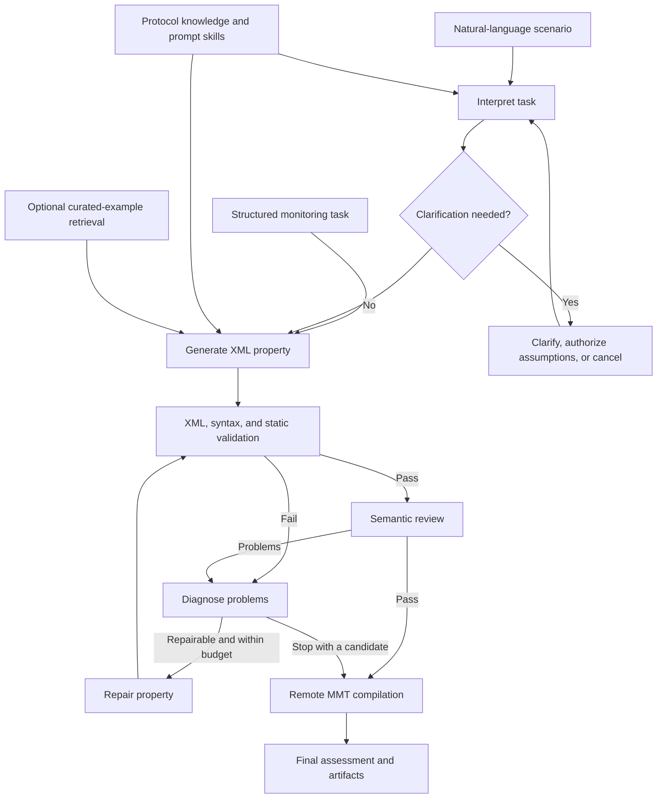

# Agentic Property Generation

A research prototype that turns monitoring requirements into MMT event-based XML properties, checks them, and attempts to repair problems before submitting them to an MMT compiler.

It combines specialized LLM agents with local protocol knowledge, reusable prompt skills, deterministic validators, and LangGraph orchestration.

## What the project does

- Accepts a structured monitoring task or a natural-language scenario.
- Interprets natural-language requirements and asks for clarification or explicit permission to make minimal assumptions.
- Generates XML using protocol attribute knowledge and, optionally, curated property examples.
- Checks XML structure, MMT syntax, static constraints, and semantic alignment with the task.
- Diagnoses problems, performs bounded repair, and records remote compilation evidence in a final assessment.

The output is a candidate property plus assessment evidence. The workflow does not deploy monitoring rules or replay traffic. Compilation and semantic review do not prove that a property behaves correctly on real traffic.

## Architecture



Local validation and semantic review can trigger repair. Remote compilation is terminal evidence: a compiler failure does not start another repair cycle. Blocked or unsuccessful runs may terminate before compilation.

All LLM agents in a runtime share one LiteLLM client. Pydantic models define the contracts between components. Example retrieval uses deterministic matching over curated metadata; it does not require embeddings or a vector database.

## Setup

Use Python 3.11 to match the existing local environment. Run the source directly with `PYTHONPATH` configured.

From the project root:

```bash
python3 -m venv .venv
source .venv/bin/activate
python3 -m pip install -r requirements.txt
export PYTHONPATH="$PWD/src"
```

All subsequent shell commands assume you are in `agentic-property-generation/`, with the environment active and `PYTHONPATH` set.

For generation, you need a reachable LLM provider. The examples below use the configured local Ollama model `ollama/qwen2.5-coder:7b` at `http://localhost:11434`; install and make that model available before running them. You can supply another LiteLLM model identifier and its provider configuration instead.

For a complete workflow, you also need a running MMT compilation receiver. Its setup is described below. Main application CLIs do not load `.env` automatically; export any credentials required by your selected provider into the process environment.

## Quickstart: generate a candidate

This command needs an LLM service but does not need an MMT receiver:

```bash
python3 scripts/generate_property.py \
  data/scenarios/ngap_example2.json \
  --model ollama/qwen2.5-coder:7b \
  --api-base http://localhost:11434 \
  --retrieval --save-results
```

The example requests two NGAP events with procedure code `4`, correlated by the same AMF UE identifier, within ten seconds. This entry point generates a candidate; it does not run the full validation, review, repair, and compilation workflow.

## Run the complete workflow

### From a structured task

```bash
python scripts/run_workflow.py \
  data/scenarios/ngap_example.json \
  --model ollama/qwen2.5-coder:7b \
  --api-base http://localhost:11434 \
  --mmt-endpoint http://localhost:8000 \
  --retrieval \
  --output results/workflow-summary.json
```

The structured CLI checks receiver health before execution. `--mmt-endpoint` is the receiver's base URL, without `/compile`.

A task JSON requires `id`, `property_id`, `description`, and a nonempty `protocols` list. Optional fields include `requirements`, `restrictions`, `monitoring_point`, `expected_behavior`, `ambiguities`, `assumptions`, and `metadata`. Use the [explicit example](data/scenarios/ngap_example2.json) as a starting point. The [other NGAP example](data/scenarios/ngap_example.json) intentionally leaves requirements ambiguous.

### From natural language

```bash
python scripts/run_natural_language_workflow.py \
  --task-id ngap-demo \
  --property-id 102 \
  --scenario "Detect two NGAP messages with procedure code 4 for the same AMF UE identifier within 10 seconds." \
  --model ollama/qwen2.5-coder:7b \
  --api-base http://localhost:11434 \
  --mmt-endpoint http://localhost:8000 \
  --retrieval \
  --output results/natural-language-result.json
```

If information is missing, the interactive CLI lets you clarify it, authorize minimal assumptions for the remainder, or cancel. The default limit is three clarification rounds.

### Common configuration

| Setting | Default | Purpose |
| --- | --- | --- |
| `--temperature` | `0.0` | Model sampling configuration |
| `--retrieval` | Disabled | Supply curated examples to generation |
| `--retrieval-k` | `2` | Maximum number of retrieved examples |
| `--retrieval-min-score` | `0.55` | Minimum retrieval relevance score |
| `--max-repair-attempts` | `2` | Bound automatic repair |
| `--results-dir` | `results` | Artifact output directory |
| `--output` | Unset | Save a separate JSON result or summary |

The natural-language CLI additionally exposes `--llm-timeout` (300 seconds by default) and `--max-clarification-rounds`. Use `--no-save-results` for the structured workflow or `--no-save-artifacts` for the natural-language workflow to disable automatic artifact persistence. Generation-only persistence requires `--save-results`.

Run any entry point with `--help` for its exact options.

## Outputs and acceptance

When artifact saving is enabled, generated attempts are stored under `results/<sanitized-task-id>/`:

- `generation_attempt_<n>.xml`: candidate XML for an attempt.
- `generation_attempt_<n>.json`: candidate metadata.
- `final_property.xml`: the final candidate, when available.
- `final_assessment.json`: validation, semantic, compilation, and repair evidence.

**A saved final property is not necessarily accepted.** Inspect the final assessment and the workflow's `success` value. Assessment statuses are `accepted`, `rejected_validation`, `rejected_semantic`, `rejected_compilation`, `blocked`, and `inconclusive`.

In the natural-language result, `status: completed` indicates that execution completed; check `property_result.success` and its final assessment for acceptance. Missing validation evidence and infrastructure failures can produce an inconclusive result.

Use distinct task IDs or result directories to retain independent runs. Generated artifacts are experimental outputs and are never automatically added to the curated retrieval repository.

## MMT compilation receiver

The optional [receiver service](src/property_receiver/mmt_rule_receiver.py) runs on a host with MMT-Security installed. The compiler itself is not bundled with this project.

The receiver expects:

- Compiler executable: `/opt/mmt/security/bin/compile_rule`.
- Writable XML directory: `/opt/mmt/security/rules/custom_xml`.
- Writable compiled-rule directory: `/opt/mmt/security/rules/custom_so`.

These paths are configured in the receiver source. FastAPI and Uvicorn are absent from the application requirements file; install them separately on the receiver host:

```bash
python -m pip install fastapi uvicorn
python -m uvicorn property_receiver.mmt_rule_receiver:app \
  --host 127.0.0.1 --port 8000
```

The service provides `GET /health`, `POST /compile`, and `POST /compile/debug`. Compilation accepts raw XML with `Content-Type: application/xml` and an `X-Rule-Filename` header. The client checks compilation evidence and verifies the XML hash when the receiver supplies one.

Test a running receiver with:

```bash
python scripts/test_compilation_endpoint.py \
  data/scenarios/grounded_generator.xml \
  --endpoint http://localhost:8000
```

The receiver's compilation timeout is 180 seconds; the client defaults to 200 seconds. Temporary XML and compiled artifacts are deleted by default. Set `MMT_DELETE_ARTIFACTS_AFTER_COMPILE=false` before starting the service to retain them for debugging.

The receiver has no application authentication, TLS, or request-size limit. Keep access restricted to a trusted compilation environment. It compiles candidates without deploying them as active monitoring rules.

## Developer guide

### Project layout

| Location | Responsibility |
| --- | --- |
| [`src/property_agent/agents/`](src/property_agent/agents/) | Interpretation, assumption resolution, generation, semantic review, repair |
| [`src/property_agent/workflow/`](src/property_agent/workflow/) | Runtime assembly, graph routing, clarification, and workflow state |
| [`src/property_agent/models/`](src/property_agent/models/) | Typed task, property, validation, and result contracts |
| [`src/property_agent/context/`](src/property_agent/context/) | Context supplied to each agent |
| [`src/property_agent/skills/`](src/property_agent/skills/) | Reusable prompt instructions and domain restrictions |
| [`src/property_agent/tools/`](src/property_agent/tools/) | Deterministic validation and remote compilation client |
| [`src/property_agent/retrieval/`](src/property_agent/retrieval/) | Curated-example selection |
| [`src/property_agent/repair/`](src/property_agent/repair/) | Repairability diagnosis |
| [`src/property_agent/assessment/`](src/property_agent/assessment/) | Final assessment and persistence |
| [`src/property_agent/storage/`](src/property_agent/storage/) | Generated-attempt persistence |
| [`knowledge/`](knowledge/) | Protocol attributes and curated XML examples |
| [`tests/`](tests/) | Unit and workflow tests |
| [`scripts/`](scripts/) | Application CLIs, isolated experiments, and evaluation scripts |
| [`evaluation/`](evaluation/) | Benchmarks, references, challenges, model configurations, and results |

### Use the Python API

```python
import json
from pathlib import Path

from property_agent.models import MonitoringTask
from property_agent.workflow import build_property_workflow

task = MonitoringTask.model_validate(
    json.loads(Path("data/scenarios/ngap_example2.json").read_text())
)
runtime = build_property_workflow(
    model="ollama/qwen2.5-coder:7b",
    api_base="http://localhost:11434",
    mmt_endpoint="http://localhost:8000",
    retrieval_enabled=True,
)
result = runtime.workflow.run(task)
print(result.success)
print(result.final_assessment)
```

Use `build_natural_language_workflow` for intake plus generation. Its workflow exposes `start` and `resume` for clarification. See the [interactive CLI](code/scripts/run_natural_language_workflow.py) for how to handle those decisions.

### Extend or debug the system

- Start with [runtime assembly](src/property_agent/workflow/runtime.py) for component configuration and [graph routing](src/property_agent/workflow/graph.py) for pipeline decisions.
- Use `WorkflowDependencies` to inject alternate agents, retrievers, compiler clients, or validator callables. Tests demonstrate using substitutes without live services.
- Update Pydantic contracts and their consumers together when changing component inputs or outputs.
- Change agent instructions through prompt skills and context builders; keep generation restrictions, validators, and repair behavior consistent.
- Add verified protocol knowledge under `knowledge/protocols/<protocol>/attributes.json`.
- Add curated examples through the example index and associated XML, rather than treating saved generated candidates as verified examples.

Current attribute knowledge covers `ip`, `ngap`, `gtp`, `sctp`, `http2`, `sctp_data`, `meta`, `udp`, and `nas_5g`. Having attributes for a protocol does not establish complete semantic support for every procedure.

### Run tests

```bash
python -m pytest -q
```

Tests exercise model contracts, retrieval, context, generation, validation, semantic guards, repair, compilation handling, storage, and orchestration, using fake or mocked external dependencies.

## Troubleshooting and limitations

| Symptom | What to check |
| --- | --- |
| `ModuleNotFoundError: property_agent` | Set `PYTHONPATH` to `src` and run commands from the project root. |
| LLM request failure or timeout | Verify the provider is running, the model is available, and credentials/API base are correct. The natural-language CLI exposes `--llm-timeout`. |
| Missing protocol knowledge | Check the task's protocol names against the available knowledge directories. |
| Receiver health or compilation failure | Verify the endpoint, compiler installation, permissions, and compiler diagnostics. |
| Missing FastAPI/Uvicorn | Install the receiver's separate dependencies on its host. |
| Final XML exists but the run failed | Read `final_assessment.json`; persistence is independent of acceptance. |

Semantic review depends on an LLM and the available knowledge; scores are assessment evidence, not a formal correctness guarantee. Repair is bounded, and unsupported requirements may remain blocked or rejected.